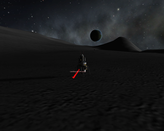

# kOS_scripts

Scripts and libraries for the kOS mod for the computer game Kerbal Space Program.

### Headline Items

There are boot scripts that automate (as much as is possible) certain contract types:
 - launching tourists into orbit of Kerbin (and its moons) and returning
 - launching satellites into specific orbits of Kerbin and its moons
 - launching a rescue craft to pick-up and return Kerbals from orbit of either Kerbin or one of its moons.
   * EVAing over the Kerbal to the rescue craft still has to be done manually!
   * a variation on this can be used to transfer to a craft in orbit of a moon and dock there
 - science harvesting (intended for probes, not Human-rated though perhaps could be considered Kerbal-rated!):
   * automated visiting of orbital waypoints to trigger science experiments
   * automated moon landing and return

### Coming Items

What I'm currently working on:
 - precision landing capability / slope detection (to make the moon landing scripts suitable for crewed vessels)
 - guided re-entry capability (return from an 85km by 85km low Kerbin orbit is targeted to land in the sea adjacent to the KSC, but otherwise we don't aim at any location, we land wherever we happen to end up)
 
On the long-term plan:
 - inter-planetary transfers, extending the tourist/rescue/satellite missions beyond Kerbin's sphere of influence
 - improvements to the rendezvous and docking capabilities. They work, but could be better

### Documentation

To keep the file-sizes down, most of the code is uncommented and many function parameters have very short names. Everything is documented separately in the documentation directory.

### About

Written for kOS v1.1.0 and KSP v1.2.2.

ElWanderer / Geoff Banks
